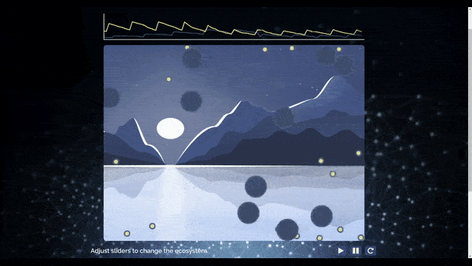

# Talons: A predator-prey dynamics simulator

[Live Site](https://dbodow.github.io/talons/)

## Table of Contents
  * [Background and Overview](#background-and-overview)
  * [Setting Parameters](#setting-parameters)
  * [UI](#ui)
    * Panoramic Scrolling
    * Population Graphing
  * [Coding Logic](#coding-logic)
    * Physics Simulation
    * Object-Oriented Practices

## Background and Overview
Predator-prey dynamics is a [complex area of study](https://en.wikipedia.org/wiki/Lotka%E2%80%93Volterra_equations) in ecosystems biology. However, [existing tools](https://www.google.com/search?channel=fs&q=predator+prey+simulation&ie=utf-8&oe=utf-8) for simulating these phenomena tend to be [highly abstract](http://www.phschool.com/atschool/phbio/active_art/predator_prey_simulation/) or [outdated and visually unappealing](http://www.shodor.org/interactivate/activities/RabbitsAndWolves/). Furthermore, these models endogenize important fitness factors in determining reproduction and survivorship into black-box categories such as 'predator effectiveness' or 'prey birthrate'.  

**Talons** aims to create a predator-prey simulation that is more visually appealing and accessible to less technical users. Users will generate a model ecosystem consisting of predators (eagles) and prey (sparrows). By selecting adaptive characteristics of both predators' and prey's offspring, users can visualize the effects of fitness on population dynamics by controlling predator & prey traits. For example, the user can choose to increase the predators' speed at the cost of lowering their energy efficiency. Users can then observe the population dynamics both in real-time as predators and prey interact on screen, and also view charts of the population dynamics to evaluate data more formally.

Predators will move towards prey based on an inverse-square distance relationship. Prey will run from predators based on a similar inverse-square distance relationship.

## Setting Parameters

Users can specify parameters that determine predators' and prey's fitness levels by moving sliders below the panorama. By controlling the relative fitness of predators and prey, users can examine different ecosystem dynamics. For example, launching simulations with highly fit predators and overly-numerous prey tends to spike and then crash predator populations, while balancing relative fitness tends toward a more stable state.

Parameters adjust fitness as follows:
* Predators
  * Speed: faster movement allows predators to more easily catch prey
  * Perception: higher perception favors chasing prey over continuing momentum in a single direction when updating predators' movement vectors
  * Efficiency: higher efficiency increases the time predators can survive without eating before starvation
  * Reproduction Time: faster reproduction allows the predator population to grow at a faster rate

* Prey
  * Speed: faster movement allows prey to run more quickly from nearby predators
  * Camouflage: reduces each prey's 'gravitational field' strength in physics modeling, impeding predators ability to detect and react to prey movement
  * Ecosystem Capacity: sets a maximum limit on prey populations before mass starvation
  * Reproduction Time: faster reproduction allows the prey population to grow at a faster rate

## UI

### Panoramic scrolling
In order to provide users with a more interactive experience, the Talons simulation implements a rectilinear 360 degree panoramic view in HTML canvas.  

Two event listeners coordinate to make an panorama panning intuitive. A `mousemove` listener tracks mouse position over the canvas and increases/decreases an offset variable `dx` as users mouse to the right/left. The canvas renders all elements with `dx` added to the x-position. The middle two-thirds of the canvas is inactive, so only mousing to the edges triggers the panning.

A `mouseout` listener tracks when the user is no longer panning the image, triggering a geometric dampening of the change in `dx`; `mousemove` similarly triggers this dampening when it detects the mouse has stopped moving. By dampening the `dx` incrementation, the user experiences a smooth deceleration of panning movement.

Finally, when the `Panorama` model detects that `dx` has incremented to the point that the image no longer fills the canvas, it stitches the panoramic background image at this seam to create a full 360 degree view. When `dx` exceeds the image width, modular arithmetic loops it back to 0;



### Population Graphing
A real-time graph of predator and prey populations is implemented in a second HTML canvas above the simulation. On a one-second interval, a new datapoint of predator and prey population sizes is plotted with height relative to the carrying capacity of the ecosystem. When 100 points have been collected, spanning the entire graph, the oldest point is removed from the array of datapoints and a fresh datapoint is pushed to the array. When the graph re-draws, it creates an intuitive effect of pushing the old data off-screen to the left.

## Coding Logic
Because the ecosystem simulation requires fairly complex mathematical modeling, maintaining scalable and maintainable code was essential for this project.

### Physics Simulation
Predators chase prey based on the inverse-square of their distance from the prey; prey run from predators in a similar manner. This creates the effect similar to gravitational movement: predators will try to change direction to move wherever this 'gravity' of the prey is strongest.  

A naive implementation would require quadratic time complexity to implement this effect by iterating through each predator and then iterating through each prey to determine its net gravitational pull.  

However, by using a field-based approach, the Talons simulation computes this gravitation in linear time. The background image is divided into a net of smaller cells, and each predator adds gravitational value to a neighborhood of nearby cells (because gravitation tapers of quickly at an inverse-square rate, each predator need only update a few cells nearby them). This field is passed to the prey, who can calculate their fleeing gradient from the field and optimally move away from predators. Constructing the field takes `O(predators)` time and constructing the new movement vectors takes `O(prey)` time, resulting in a linear `O(predators + prey)` time complexity. The process for predators computing their movement in response to prey is similar. By managing the physics simulation in better time complexity, users can create hundreds of animated predators and prey.

```
// from field.js
calculateField(organismsController) {
  this.resetField();
  organismsController.organisms.forEach( organism => {
    this.updateField(organism);
  });
}

updateField(organism) {
  let x, y;
  ({x, y} = this.fieldPosition(organism));
  for (let row = y - this.gravitationNbhd; row < y + this.gravitationNbhd; row++) {
    for (let col = x - this.gravitationNbhd; col < x + this.gravitationNbhd; col++) {
      // JS will get mad if you try to change the iterator mid loop.
      let modCol = col;
      if (row < 0 || row >= this.fieldSize.rowCount) continue;
      if (modCol < 0 || modCol >= this.fieldSize.colCount) {
        modCol = positiveMod(modCol, Math.floor(this.fieldSize.colCount));
      }
      const pointVector = this.sgn * gravitation(distance(x, y, modCol, row, this.fieldSize.colCount));
      this.field[row][modCol] += pointVector;
    }
  }
}
```

### Object Oriented Practices
An early version of this project attempted to manage all logic in just four classes, which quickly became highly coupled and painful to debug. This was a lesson learned: after first refactoring, code has been sequestered in tidy classes with single concerns.

For instance, the `PredatorsController` and `PreysController` classes, which now manage logic pertaining to all predators or all prey, initially attempted to handle field logic and predator-prey interactions as well. Passing data back and forth became difficult and buggy, leading to the emergence of a distinct `Zoo` class that manages only interactions across the species in refactoring. Since then, all classes have been designed with the single-concern principle in mind, allowing for substantially more rapid development of new features.

One interesting pattern that emerged from these design principles was a Redux-like architecture. The `SimulationParams` class manages the state of all changeable parameters within the simulation, creating a (nearly) 'single source of truth', analogous to the Redux store. `SimulationParams` also includes several instance methods which return logically grouped 'slices of state' for use in other classes. For instance, `SimulationParams` has the method `predatorsParams` which is useful in initializing and updating the `PredatorsController` and `Predators` classes:

```
// instance method from SimulationParams in simulation_params.js
predatorsParams() {
  return {
    count: this.predatorCount,
    predatorParams: {
      speed: this.predatorSpeed,
      radius: this.predatorRadius,
      color: this.predatorColor,
      efficiency: this.predatorEfficiency,
      perception: this.predatorPerception
    },
    reproductionPeriod: this.predatorReproductionPeriod
  };
}
```

Moreover, the class hierarchy is reminiscent of React components. Certain classes behave as containers managing state-interactions across other classes initialized within them, while other classes behave more as presentational components, managing data for rendering on the canvas. For instance, the `Zoo` class mainly concerns itself with data transmission across the prey, and predators; in contrast, each of these classes that `Zoo` focuses on executing logic vital to accurate rendering of shapes on the canvas.  

In summary, while this project was completed purely in Vanilla JS, I have come to appreciate the deeper reasoning for the design patterns enforced through React/Redux, and applied them to create a more maintainable codebase in Talons.
