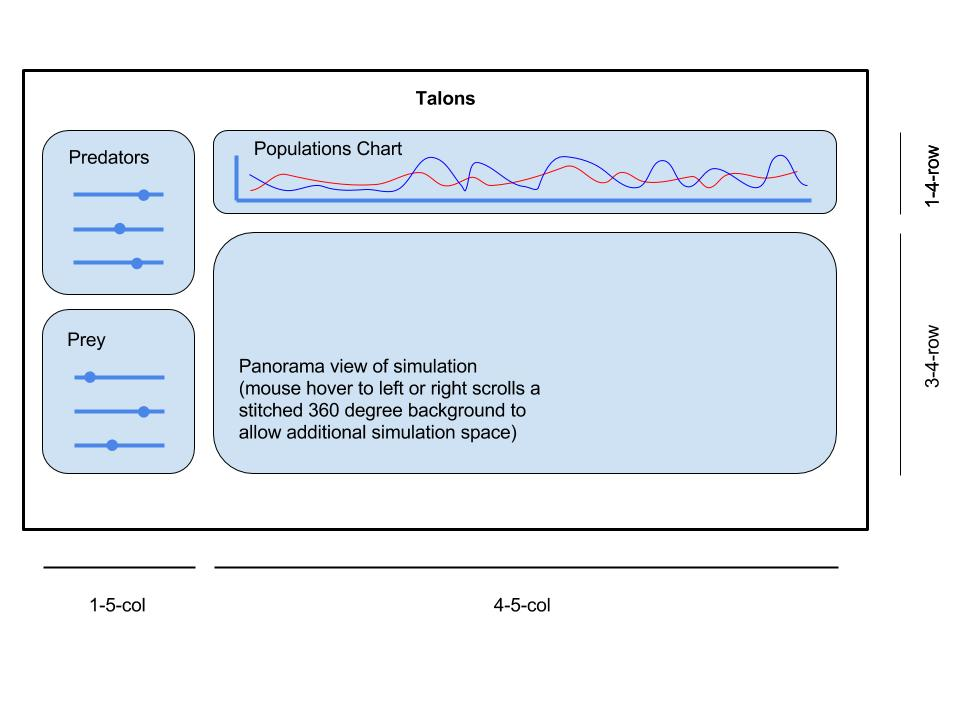

# Talons: A predator-prey dynamics simulator

## Background and Overview
Predator-prey dynamics is a [complex area of study](https://en.wikipedia.org/wiki/Lotka%E2%80%93Volterra_equations) in ecosystems biology. However, [existing tools](https://www.google.com/search?channel=fs&q=predator+prey+simulation&ie=utf-8&oe=utf-8) for simulating these phenomena tend to be [highly abstract](http://www.phschool.com/atschool/phbio/active_art/predator_prey_simulation/) or [outdated and visually unappealing](http://www.shodor.org/interactivate/activities/RabbitsAndWolves/). Furthermore, these models endogenize important fitness factors in determining reproduction and survivorship into black-box categories such as 'predator effectiveness' or 'prey birthrate'.  

**Talons** aims to create a predator-prey simulation that is more visually appealing and accessible to less technical users. Users will generate a model ecosystem consisting of predators (eagles) and prey (sparrows). By selecting adaptive characteristics of both predators' and prey's offspring, users can visualize the effects of fitness on population dynamics by controlling predator & prey traits. For example, the user can choose to increase the predators' speed at the cost of lowering their energy efficiency. Users can then observe the population dynamics both in real-time as predators and prey interact on screen, and also view charts of the population dynamics to evaluate data more formally.

Predators will move towards prey based on an inverse-square distance relationship. Prey will run from predators based on a similar inverse-square distance relationship.

## Functionality and MVP

### At Launch
Users will be able to:
* Set values for predator and prey fitness, including:
  * Predators:
    * Movement Speed
    * Energy Efficiency (duration the predator survives without feeding)
    * Longevity (duration the predator lives before dying of natural causes)
  * Prey:
    * Movement Speed
    * Camouflage (a linear weight reducing the 'gravitation' of predators)
    * Toxins (a small probability chance to kill a predator when attacked)
    * Nest size (number of children per reproductive period)

* Seed the simulation with new predators or prey with custom fitness values
* View a predation simulation on a panoramic scrolling background
* View a graph charting predator and prey populations on the same axes

### Priority Enhancements

* Predators and prey will not be represented by simple shapes, but rather by distinct animated sprites
* Incorporate ambient music
* Incorporate action sound

### Stretch Enhancements

* Write unit tests
* Two player mode with asymmetric predator v.s. prey gameplay

## Wireframes

## Architecture and Technologies

* Vanilla JS for scripting
* HTML5 Canvas for implementing simulation panorama
* Webpack for bundling
* Maybe Chart.js, though I'm interested in implementing my own charts if time allows
* If time, I'd like to learn CSS Grid for layouts

File Hierarchy:

`index.html`  
`main.js`  
| `simulation`  
--| `panorama.js`  
--| `organism.js`  
--| `predator.js`  
--| `prey.js`  
| `controls.js`  
| `charts.js`  

## Implementation Timeline

I will take a "learn as you go" approach to HTML canvas.

**Weekend**
* Envision project
* Build scrolling panorama  

**Monday**
* Develop organisms, predators, and prey with basic gravitation / Movement

**Tuesday**
* Develop/balance parameters for organisms

**Wednesday**
* Develop game controls
* Create and begin styling UI for setting parameters

**Thursday**
* Implement charts
* Polish CSS and bug squash
* If ahead of schedule: Implement priority enhancements
